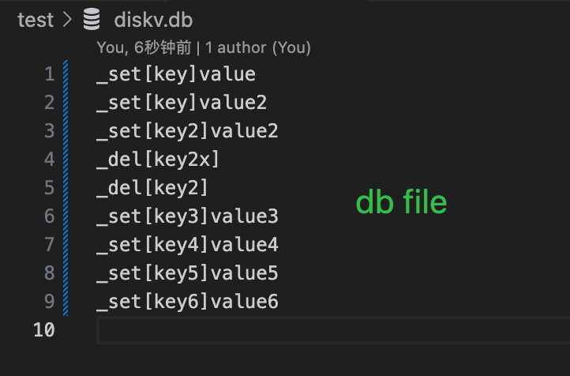
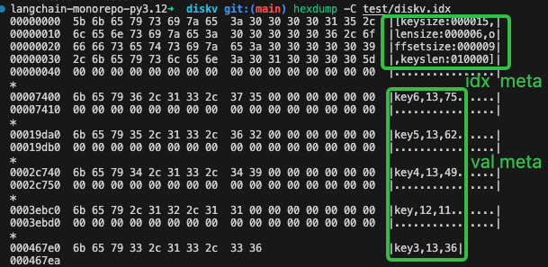

# diskv

一般我们要使用 kv 存储时，多用 redis、rocksdb、leveldb 等等，这些存储各有优势，能满足绝大多数的需求。

但这些存储系统有有一个特点： 底层都是基于二进制存储，需要专门的工具才能查看相关数据。
这一操作核心是提升读写的性能，和压缩存储大小。

但有些时候，我们希望用更简单的方式去存储数据，简单到我们肉眼就能读懂的程度。
这让我们对 "数据丢失" 和 "数据恢复" 操作不熟练的同学，心中不免多有不安。

于是，我希望实现一个极简的 kv 存储系统，满足两个基本理念：
- 以明文方式存储数据，让数据可读性高
- 极力减小对内存的占用，所有操作，尽量都通过直接操作文件系统完成

从文件存储上看，如下:
<p align="center">
  
  
</p>

## 快速上手

### 创建一个 db
```go
db, err := diskv.CreateDB(ctx, &diskv.CreateConfig{})

// 或者用默认的 config
config := DefaultCreateConfig
config.Dir = dir

db, err = diskv.CreateDB(ctx, &config)
```

### 数据操作
```go
// 存储
err = db.Set(ctx, key, bytesValue)
err = db.SetString(ctx, key, stringValue)

// 读取
bytesValue, err := db.Get(ctx, key)
stringValue, err := db.GetString(ctx, key)

// 删除
ok, err := db.Delete(ctx, key)

// 检查是否存在
has, err := db.Has(ctx, key)

// 遍历
err = db.ForEach(ctx, func(key string, value []byte) bool {
    return true // 继续遍历
})

```


## TODO

- [ ] 支持 idx 文件迁移
- [ ] 支持 db 文件压缩 + 迁移
- [ ] 支持用 db 文件重构 idx 文件
